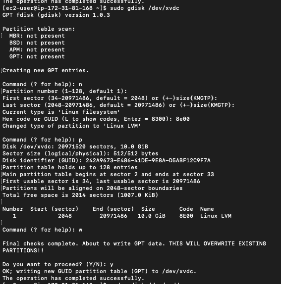
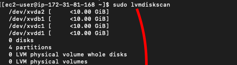
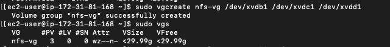
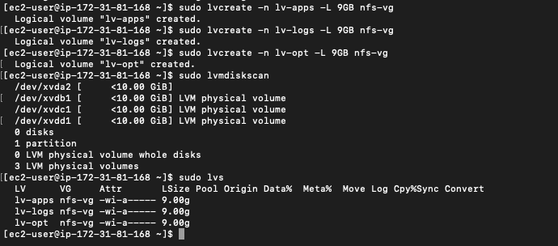
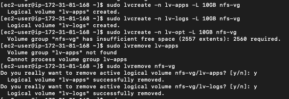
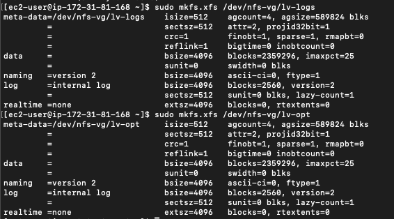
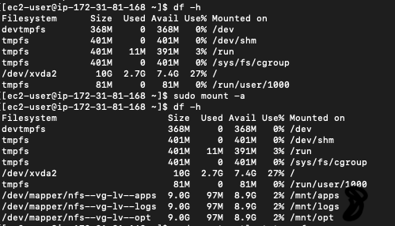
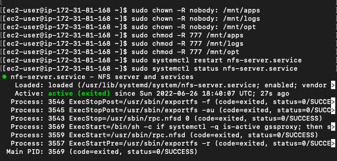
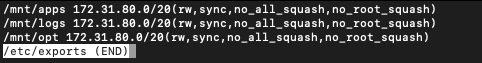
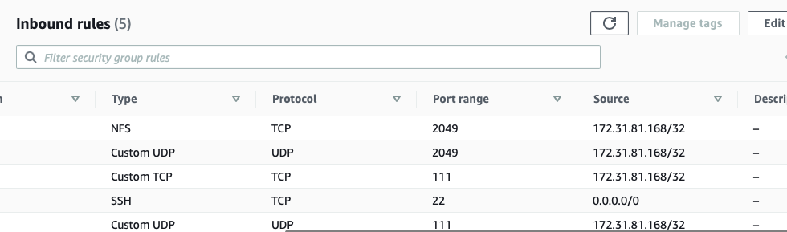

# Project 7 - DevOps Tooling Website Solution

**Step 1 - Prepare the NFS server**
---

- Spun up a new RHEL 8 OS on AWS. Attached 3 EBS blocks of 10GB each. Ran the `lsblk` command to confirm.


- Ran the `df -h` command to see all available mounts on the server before configuring the various servers. Also installed the `lvm2` tool for storage/partitioning config.


- Used the `gdisk` tool to create a single partition on each of the 3 disks. This step mustbe done on all 3 disks to be valid.
    - Ran `sudo gdisk /dev/xvdb` to configure the partition on the first disk. Use the screenshot below as guide.
    
*When creating a new partition, use 8E00 to select LVM*

- Ran the `lsblk` command to see the newly configured partitions.


- Ran the `lvmdiskscan` command to scan the disk before setting up the physical volumes that is needed for the partitioning.


- Used the `pvcreate` command to create the physical volumes needed for the 3 disks. See command below. Note that the directory is dependent on where the disks were attached and the name assigned.
```
sudo pvcreate /dev/xvdb1
sudo pvcreate /dev/xvdc1
sudo pvcreate /dev/xvdd1
```
After running the above command to create the physical volume, used the `sudo pvs` and `sudo lvmdiskscan` to check for the newly created physical volumes.


- Used the `vgcreate` utility to add all PVs to a volume group called nfs-vg. Checked the VG with `sudo vgs`


- Used the `lvcreate` utility to create the required logical volumes which are `lv-apps`, `lv-opt` & `lv-logs`. Assigned them 9GB each. Checked the config using `sudo lvmdiskscan` & `sudo lvs`


*I ran into an issue where I assigned each LV 10GB and ran out of space while configuring the third LV. I had to use `lvremove nfs-vg` to remove all the LVs from the `nfs-vg` volume group*


- Formatted the logical volumes using the `xfs` filesystem. Used `sudo mkfs.xfs /<filepath>`


*Use `sudo vgdisplay -v #view complete setup - VG, PV, and LV` to get a comprehensive report of all PVs, VGs and LVs*

- Created mount points on the /mnt directory for the 3 created logical volumes where data will be stored. After creating the points, mounted all LVs to their respective paths.


- In order to make the above configs persist after a system restart, the UUID of the 3 paths needs to be copied and pasted in the /etc/fstab file. Ran `sudo blkid /dev/nfs-vg/*`, which shows the UUID ofthenewly created logical volumes.


- Head over to the `/etc/fstab` file and paste the copied UUIDs to look like the format below.


- Run `sudo mount -a` to mount changes. After that, run `df -h` to see if changes have been made.


**Step 1.1 - Install NFS Server**
---

- Ran the following commands to update the RHEL server and install the NFS.
```
sudo yum -y update
sudo yum install nfs-utils -y
```
- Ran the following commands to startup the NFS server and check if itis running.
```
sudo systemctl start nfs-server.service
sudo systemctl enable nfs-server.service
sudo systemctl status nfs-server.service
```
- Set up the permissions on the server to allow the web servers read and execute files on the NFS. Restart the NFS server after config. See screenshot below:


- Locate the subnet CIDR from AWS (or wherever) as this is needed to allow clients on the same subet to access the NFS files.


- Using the subnet CIDR gooten from earlier, we cconfigure access to NFS for clients within the same subnets. Ran a `sudo vi /etc/exports` and pasted the following config lines to declare the subnet CIDR to be used for communication.
```
/mnt/apps <Subnet-CIDR>(rw,sync,no_all_squash,no_root_squash)
/mnt/logs <Subnet-CIDR>(rw,sync,no_all_squash,no_root_squash)
/mnt/opt <Subnet-CIDR>(rw,sync,no_all_squash,no_root_squash)
```


- Ran `sudo exportfs -arv` to export the above CIDR range.

- Ran `rpcinfo -p | grep nfs` to check what port is being used by NFS so it can be opened in the security group.


- Opened up the required ports from the above step to allow inbound traffic. Tightened security to use only the private IP of the machine and not 0.0.0.0


**Step 2 - Configure The Database Server**
---

- Spin up a new instance of Ubuntu Linux for the database server & enable the SQL port in the security group.

- Installed MySQL server by running `sudo apt install -y mysql-server`. Ran the following code below which enables, restarts and displays the status of the server.
```
sudo systemctl enable mysqld
sudo systemctl restart mysqld
sudo systemctl status mysqld
```
*Note that for Redhat, you use `mysqld` & for Ubuntu use `mysql`.*

- Ran the following code below to configure the database setup.
```
sudo mysql
CREATE DATABASE tooling;
CREATE USER 'webaccess'@'<PrivateIP>' IDENTIFIED BY '<password>';
GRANT ALL ON tooling.* TO 'webaccess'@'<WebserverSubnet>';
FLUSH PRIVILEGES;
SHOW DATABASES;
exit
```


**Step 3 - Prepare The Web Servers**
---

- forget: bind sql db, fstab, sudo mount, db error, 