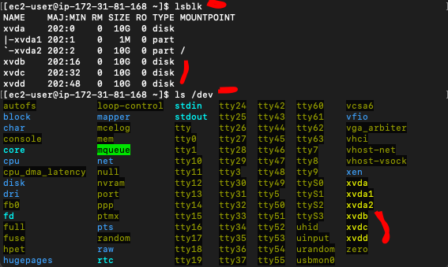
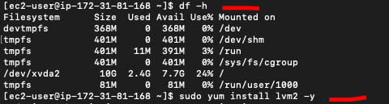
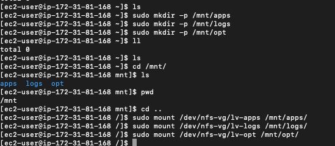
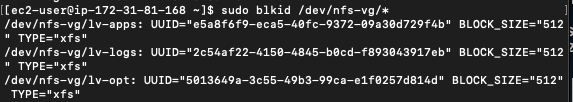
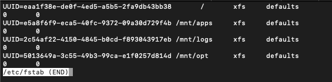
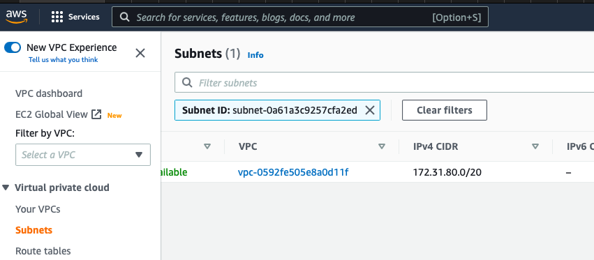
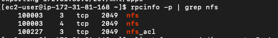

# Project 7 - DevOps Tooling Website Solution

**Step 1 - Prepare the NFS server**
---

- Spun up a new RHEL 8 OS on AWS. Attached 3 EBS blocks of 10GB each. Ran the `lsblk` command to confirm.


- Ran the `df -h` command to see all available mounts on the server before configuring the various servers. Also installed the `lvm2` tool for storage/partitioning config.


- Used the `gdisk` tool to create a single partition on each of the 3 disks. This step mustbe done on all 3 disks to be valid.
    - Ran `sudo gdisk /dev/xvdb` to configure the partition on the first disk. Use the screenshot below as guide.
    
*When creating a new partition, use 8E00 to select LVM*

- Ran the `lsblk` command to see the newly configured partitions.


- Ran the `lvmdiskscan` command to scan the disk before setting up the physical volumes that is needed for the partitioning.


- Used the `pvcreate` command to create the physical volumes needed for the 3 disks. See command below. Note that the directory is dependent on where the disks were attached and the name assigned.
```
sudo pvcreate /dev/xvdb1
sudo pvcreate /dev/xvdc1
sudo pvcreate /dev/xvdd1
```
After running the above command to create the physical volume, used the `sudo pvs` and `sudo lvmdiskscan` to check for the newly created physical volumes.


- Used the `vgcreate` utility to add all PVs to a volume group called nfs-vg. Checked the VG with `sudo vgs`


- Used the `lvcreate` utility to create the required logical volumes which are `lv-apps`, `lv-opt` & `lv-logs`. Assigned them 9GB each. Checked the config using `sudo lvmdiskscan` & `sudo lvs`


*I ran into an issue where I assigned each LV 10GB and ran out of space while configuring the third LV. I had to use `lvremove nfs-vg` to remove all the LVs from the `nfs-vg` volume group*


- Formatted the logical volumes using the `xfs` filesystem. Used `sudo mkfs.xfs /<filepath>`


*Use `sudo vgdisplay -v #view complete setup - VG, PV, and LV` to get a comprehensive report of all PVs, VGs and LVs*

- Created mount points on the /mnt directory for the 3 created logical volumes where data will be stored. After creating the points, mounted all LVs to their respective paths.


- In order to make the above configs persist after a system restart, the UUID of the 3 paths needs to be copied and pasted in the /etc/fstab file. Ran `sudo blkid /dev/nfs-vg/*`, which shows the UUID ofthenewly created logical volumes.


- Head over to the `/etc/fstab` file and paste the copied UUIDs to look like the format below.


- Run `sudo mount -a` to mount changes. After that, run `df -h` to see if changes have been made.


**Step 1.1 - Install NFS Server**
---

- Ran the following commands to update the RHEL server and install the NFS.
```
sudo yum -y update
sudo yum install nfs-utils -y
```
- Ran the following commands to startup the NFS server and check if itis running.
```
sudo systemctl start nfs-server.service
sudo systemctl enable nfs-server.service
sudo systemctl status nfs-server.service
```
- Set up the permissions on the server to allow the web servers read and execute files on the NFS. Restart the NFS server after config. See screenshot below:


- Locate the subnet CIDR from AWS (or wherever) as this is needed to allow clients on the same subet to access the NFS files.


- Using the subnet CIDR gooten from earlier, we cconfigure access to NFS for clients within the same subnets. Ran a `sudo vi /etc/exports` and pasted the following config lines to declare the subnet CIDR to be used for communication.
```
/mnt/apps <Subnet-CIDR>(rw,sync,no_all_squash,no_root_squash)
/mnt/logs <Subnet-CIDR>(rw,sync,no_all_squash,no_root_squash)
/mnt/opt <Subnet-CIDR>(rw,sync,no_all_squash,no_root_squash)
```


- Ran `sudo exportfs -arv` to export the above CIDR range.

- Ran `rpcinfo -p | grep nfs` to check what port is being used by NFS so it can be opened in the security group.


- Opened up the required ports from the above step to allow inbound traffic. Tightened security to use only the private IP of the machine and not 0.0.0.0


**Step 2 - Configure The Database Server**
---

- Spin up a new instance of Ubuntu Linux for the database server & enable the SQL port in the security group.

- Installed MySQL server by running `sudo apt install -y mysql-server`. Ran the following code below which enables, restarts and displays the status of the server.
```
sudo systemctl enable mysql
sudo systemctl restart mysql
sudo systemctl status mysql
```
*Note that for Redhat, you use `mysqld` & for Ubuntu use `mysql`.*

- Ran the following code below to configure the database setup.
```
sudo mysql
CREATE DATABASE tooling;
CREATE USER 'webaccess'@'<PrivateIP>' IDENTIFIED BY '<password>';
GRANT ALL ON tooling.* TO 'webaccess'@'<WebserverSubnet>';
FLUSH PRIVILEGES;
SHOW DATABASES;
exit
```


- Edit the bind address so MySQL allows connection from the specified IP used when creating the user. Run `sudo vi /etc/mysql/mysql.conf.d/mysqld.cnf` and add the IP address to the config file to set up the binding.


- Run `sudo systemctl restart mysql` to restart MySQL so the changes can take effect.

**Step 3 - Prepare The Web Servers**
---

- Launch 3 new instances (the number depends on the use case) of RHEL 8 & edit the inbound rule for port 80 (web traffic). After launching the instances, run `sudo yum install nfs-utils nfs4-acl-tools -y` to install the NFS client on them. This is what will communicate with the NFS server to make them "redundant' where files that are edited or deleted in the mounted drives (which will be done below) will be consistent across all web servers.

- Next step is to create a folder/directory on the webserver where the web content will be served (displayed so you can see it on the internet). The folder is `/var/www`. Run `sudo mkdir /var/www` to create the folder.

- After the above folder has been created, we need to map it to the original drive (`mnt/apps`) in the server so the client can communicate with it. Run `sudo mount -t nfs -o rw,nosuid <NFS-Server-Private-IP-Address>:/mnt/apps /var/www`. Run `df -h` to confirm settings.


- Modify the `/etc/fstab` file and add `<NFS-Server-Private-IP-Address>:/mnt/apps /var/www nfs defaults 0 0` to make the changes persist after reboot.

- Next step is to install the repository, Apache and PHP.
```
sudo yum install httpd -y

sudo dnf install https://dl.fedoraproject.org/pub/epel/epel-release-latest-8.noarch.rpm

sudo dnf install dnf-utils http://rpms.remirepo.net/enterprise/remi-release-8.rpm

sudo dnf module reset php

sudo dnf module enable php:remi-7.4

sudo dnf install php php-opcache php-gd php-curl php-mysqlnd

sudo systemctl start php-fpm

sudo systemctl enable php-fpm

setsebool -P httpd_execmem 1
```

- Verify that Apache files and directories are available on the web server on `/var/www` and on the NFS server in `/mnt/apps`. Created a file called `test.txt` and it was present in both the NFS and web server.


- Next step is to fork the GitHub repo where the tooling website source code is held to your (my) GitHub account.
    - Install git by running`sudo yum install git -y`

    - Run `git clone https://github.com/darey-io/tooling.git`. The code will copy the contents of the repo into the `/tooling` drive. See screenshot below:
    

    - Change directory back into the `/html` (/`var/www/html`) folder. You will see the `tooling` & another `html` folder in it. We need to copy the contents of the `tooling` & sub `html` folder inside the current `/var/www/html` directory as that is where Apache web files are hosted.
        - Run the following commands `mv tooling/* .` & `mv html/* .`. This command moves all the contents inside the folders (*) and drops them in the present/current directory (.)
        

    - Install MySQL on the webserver. After that, update the website's config file to be able to connect to the database. Open the `/var/www/html/functions.php` file and modify it to include the DB private IP, user, password and database.
    

    - Apply the `tooling-db.sql` script from the webserver to the database server. 
    ```
    mysql -h <databse-private-ip> -u <db-username> -p <db-pasword> < tooling-db.sql
    ```
    

    - After the script has successfully run, connect to the db vi running `mysql -h <databse-private-ip> -u <db-username> -p <db-pasword>`. After that,run `show databases` to see if the `tooling` database is there and then run `select * from users` to see the available users.
    

    - For permissions related issues, disable SELinux by running `sudo setenforce 0` from inside the `/var/www/html` folder. After that, run `sudo vi /etc/sysconfig/selinux` and set `SELINUX=disabled` to make change permanent.

    - Restart httpd to make changes take effect. Run `sudo systemctl restart httpd`.

    - Lastly, open `http://<Web-Server-Public-IP-Address-or-Public-DNS-Name>/index.php` in a browser and you should see a login page. After putting in the credentials, you willbe redirected to the propitix home page.
    

    

    