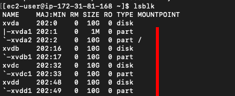

# Project 7 - DevOps Tooling Website Solution

**Step 1 - Prepare the NFS server**
---

- Spun up a new RHEL 8 OS on AWS. Attached 3 EBS blocks of 10GB each. Ran the `lsblk` command to confirm.


- Ran the `df -h` command to see all available mounts on the server before configuring the various servers. Also installed the `lvm2` tool for storage/partitioning config.


- Used the `gdisk` tool to create a single partition on each of the 3 disks. This step mustbe done on all 3 disks to be valid.
    - Ran `sudo gdisk /dev/xvdb` to configure the partition on the first disk. Use the screenshot below as guide.
    
*When creating a new partition, use 8E00 to select LVM*

- Ran the `lsblk` command to see the newly configured partitions.


- Ran the `lvmdiskscan` command to scan the disk before setting up the physical volumes that is needed for the partitioning.


- Used the `pvcreate` command to create the physical volumes needed for the 3 disks. See command below. Note that the directory is dependent on where the disks were attached and the name assigned.
```
sudo pvcreate /dev/xvdb1
sudo pvcreate /dev/xvdc1
sudo pvcreate /dev/xvdd1
```
After running the above command to create the physical volume, used the `sudo pvs` and `sudo lvmdiskscan` to check for the newly created physical volumes.


- Used the `vgcreate` utility to add all PVs to a volume group called nfs-vg. Checked the VG with `sudo vgs`


- Used the `lvcreate` utility to create the required logical volumes which are `lv-apps`, `lv-opt` & `lv-logs`. Assigned them 9GB each. Checked the config using `sudo lvmdiskscan` & `sudo lvs`


*I ran into an issue where I assigned each LV 10GB and ran out of space while configuring the third LV. I had to use `lvremove nfs-vg` to remove all the LVs from the `nfs-vg` volume group.


- 


